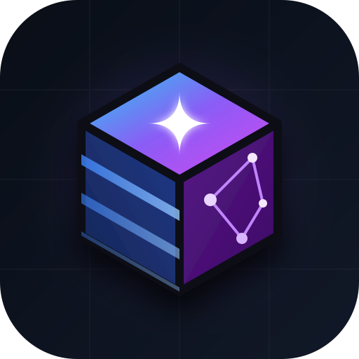

<div align="center">
  
  <h1>cds-agents</h1>
  <p><strong>The SAP CAP-native tool layer for agentic applications.</strong></p>
  <p>Turn any SAP CAP service into governed AI capabilities for LangChain, LangGraph, MCP, and enterprise agents.</p>

  [](https://www.npmjs.com/package/cds-agents)
  [](./LICENSE)
  [](https://github.com/Nagarjundas1994-AiAgents/NPM_CDS_AGENT/actions)
</div>

<br/>

```typescript
import { CAPToolkit } from 'cds-agents';

const toolkit = new CAPToolkit({
  service: 'StudentService',
  baseUrl: 'http://localhost:4004',
  toolStrategy: 'minimal',   // describe + query — not 400 CRUD tools
  allowDelete: false,
});

const tools = await toolkit.getTools();
```

**npm:** [`cds-agents`](https://www.npmjs.com/package/cds-agents) &nbsp;·&nbsp; **GitHub repo name:** `NPM_CDS_AGENT` (public identity is `cds-agents`)

---

## What is this?

A TypeScript monorepo for **cds-agents** — the capability layer between SAP CAP and AI agents.

It reads your CDS / CSN model and exposes a governed set of tools. The same capability map feeds LangChain today and MCP next.

```text
                 cds-agents
                     │
       ┌─────────────┼─────────────┐
       ▼             ▼             ▼
  CDS Introspection  Tool Layer    Runtime
       │             │             │
       ▼             ▼             ▼
     CSN/CDS     LangChain      OData V4
                    Tools       Executor
       │
       └──────────────┬──────────────┘
                      ▼
               Agent Framework
            LangGraph / MCP / custom
```

| Entry point | Role |
|---|---|
| `CAPToolkit` | Raw-tool layer. Production default. |
| `CAPAgent` | Ready-made ReAct agent for demos and small apps. |
| `ODataExecutor` | OData V4 client with structured errors, timeout, dry-run. |

This is **not** a multi-agent orchestrator. Compose `CAPToolkit` tools into LangGraph (or, soon, MCP) when you need supervisors, branching, or human-in-the-loop.

---

## Why not just generate CRUD tools?

A CAP service with 100 entities can expose 400+ tools. That is expensive for LLM discovery.

```ts
toolStrategy: 'minimal' | 'crud' | 'actions' | 'full'
```

- **`minimal`** — `describe` + `query` (token-efficient; recommended)
- **`crud`** — per-entity read/create/update/delete
- **`actions`** — bound and unbound actions/functions
- **`full`** — everything (backward-compatible default)

```typescript
await query.invoke({
  entity: 'Students',
  filter: { gpa: { lt: 2.0 }, status: 'active' },
  select: ['ID', 'firstName', 'gpa'],
  top: 10,
});
```

Disable destructive operations independently:

```typescript
{ allowCreate: true, allowUpdate: true, allowDelete: false }
```

---

## What "governed" actually means

Policy is enforced in the OData executor, so a denied operation never reaches CAP — even if
something else is holding the executor or the tool. Withholding a tool is discovery, not a
control.

Your CDS model outranks your config: `@readonly`, `@insertonly`, and
`@Capabilities.*Restrictions.*` are honoured during generation *and* execution, and config
can only subtract from them.

```typescript
const map = await toolkit.getCapabilityMap();  // the audit surface
```

The capability map and the enforcement map come from the same object, so what a service
advertises is exactly what it permits.

---

## How this relates to SAP's official packages

SAP ships in this space, so here is the honest split (registry data, 2026-08-15):

| Package | What it does |
|---|---|
| [`@cap-js/mcp`](https://www.npmjs.com/package/@cap-js/mcp) `1.4.3` | CAP **plugin** — exposes *your* CAP app as an MCP server |
| [`@cap-js/mcp-server`](https://www.npmjs.com/package/@cap-js/mcp-server) `0.0.5` | MCP server for AI-assisted **development** of CAP apps |
| [`@sap-ai-sdk/langchain`](https://www.npmjs.com/package/@sap-ai-sdk/langchain) `2.14.0` | LangChain bindings for SAP GenAI Hub **models** |

**We are not building an MCP server for CAP.** `@cap-js/mcp` is official, maintained, and
converged on the same `describe` + `query` shape we use. It was on our roadmap; it's been
dropped. If you own the CAP app, use it.

The difference is producer vs consumer. `@cap-js/mcp` is a plugin — you must own the CAP
app, add it, and redeploy. cds-agents is a client library pointed at something already
running. That matters when the service is S/4HANA, a partner's endpoint, or another team's
production app; when the agent author needs to constrain *their* agent without asking the
service owner; and when one agent spans several services as a single tool array.

`@sap-ai-sdk/langchain` is the model side, we're the tool side — they compose directly.

Full comparison, including where this positioning isn't true yet: [docs/sap-ecosystem.md](./docs/sap-ecosystem.md).

---

## Repository layout

```text
packages/cds-agents/     Published npm package
demo-app/                University CAP service + CLI chat
docs/                    Roadmap and MCP protocol notes
.github/workflows/       CI + npm publish
```

The root package is private (`cds-agents-monorepo`). The public product is **`cds-agents`**.

---

## Quick start

```bash
npm install cds-agents zod @langchain/core @langchain/openai
```

```typescript
import { CAPAgent } from 'cds-agents';

const agent = new CAPAgent({
  service: 'StudentService',
  baseUrl: 'http://localhost:4004',
  model: 'gpt-4o',
  toolStrategy: 'minimal',
});

console.log(await agent.invoke('List students with GPA below 2.0'));
```

Full API, auth, and recipes: [packages/cds-agents/README.md](./packages/cds-agents/README.md)

### Demo

```bash
cd demo-app && npm install && cds watch     # terminal 1
export OPENAI_API_KEY=sk-...
node chat.mjs                               # terminal 2
```

---

## Development

```bash
pnpm install
pnpm test
pnpm --filter cds-agents lint
pnpm build
```

CI runs lint, unit tests, build, and `npm pack` on Node 20 / 22 / 24.

---

## Roadmap

1. Product identity, capability map, tool strategies, CI
2. Query planning, dry-run explain, `@restrict` / `@requires`
3. `@cds-agents/mcp` + Inspector + OpenCode demo
4. OAuth / XSUAA / IAS, tenant context, tracing, approvals
5. CLI: `inspect`, `mcp`, `doctor`

Details: [docs/ROADMAP.md](./docs/ROADMAP.md)

## License

[MIT](./LICENSE) © [Nagarjun Das](https://github.com/Nagarjundas1994-AiAgents)
