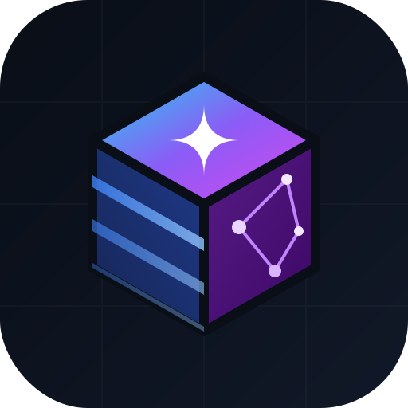
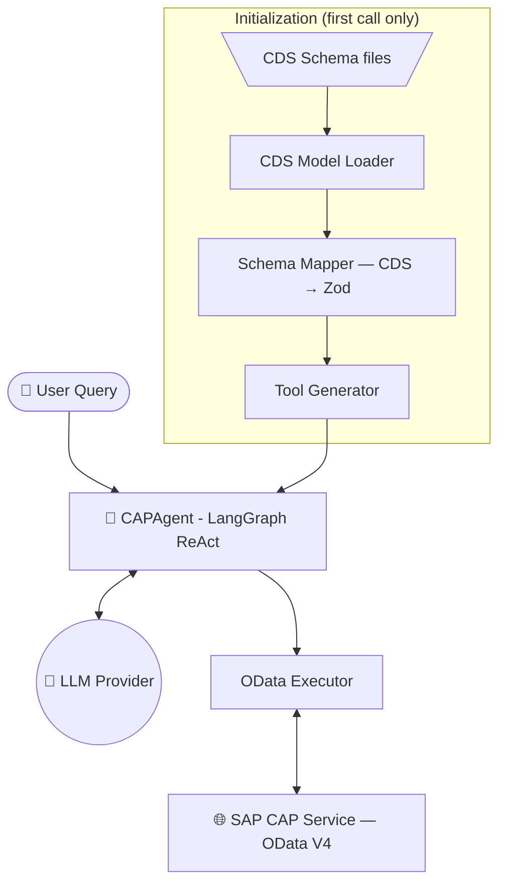

<div align="center">
  
  <h1>cds-agents</h1>
  <p><strong>AI tool generation for SAP CAP</strong></p>
  <p><em>Auto-generates LangChain tools from your CDS service definitions — so an LLM can talk to your CAP backend.</em></p>

  [](https://www.npmjs.com/package/cds-agents)
  [](https://opensource.org/licenses/MIT)
  [](https://www.typescriptlang.org/)
  [](https://js.langchain.com/)
</div>

<br/>

> **Talk to your SAP CAP database in plain English.**

`cds-agents` reads your Core Data Services (CDS) schema and **auto-generates strongly-typed [LangChain](https://js.langchain.com/) tools** — CRUD tools for every entity and execution tools for every bound/unbound action. It can spin up a ready-to-use [ReAct agent](https://langchain-ai.github.io/langgraph/concepts/agentic_concepts/#react-implementation), or hand you the raw tools so you can plug them into your own LangGraph workflow.

```typescript
import { CAPAgent } from 'cds-agents';

const agent = new CAPAgent({
  service:  'StudentService',
  baseUrl:  'http://localhost:4004',
  model:    'gpt-4o',
  tools:    'auto',
  auth:     { type: 'basic', user: 'alice', pass: 'admin' }
});

const answer = await agent.invoke("Put all students below 2.0 GPA on academic probation");
console.log(answer);
```

---

## 🎯 What This Package Is (and Isn't)

### ✅ What It Is

`cds-agents` is a **tool-generation bridge** between SAP CAP and the LangChain/LangGraph ecosystem. It solves one problem extremely well:

> *"I have a CAP service. I want an LLM to read, create, update, delete records and call actions on it — without writing hundreds of lines of boilerplate."*

Concretely, it:

1. **Parses** your CDS schema (`.cds` files or compiled CSN models)
2. **Generates** LangChain-compatible tools with rich Zod schemas and human-readable descriptions
3. **Executes** OData V4 requests against your running CAP server
4. **Optionally** wraps everything in a pre-built single-loop ReAct agent for immediate use

### ❌ What It Is NOT

This is **not** a multi-agent orchestration framework. If you need:

| Capability | Use Instead |
|---|---|
| Multi-agent graphs (supervisor → worker) | [LangGraph](https://langchain-ai.github.io/langgraph/) directly |
| Complex branching / conditional routing | LangGraph's `StateGraph` |
| Human-in-the-loop approval workflows | LangGraph + interrupt/checkpoint |
| Agent-to-agent communication | LangGraph / [CrewAI](https://www.crewai.com/) / [AutoGen](https://github.com/microsoft/autogen) |
| Cross-service orchestration | Build a custom LangGraph graph using `CAPToolkit` |

**However**, `cds-agents` is designed to **compose** with those frameworks. Use `CAPToolkit` to generate the tools, then wire them into any graph topology you want.

---

## ⚡ Why cds-agents?

Integrating LLM agents with traditional enterprise APIs usually requires massive amounts of fragile connector boilerplate. `cds-agents` eliminates this out of the box.

| The Old Way (Without `cds-agents`) | The AI-Native Way (With `cds-agents`) |
|------------------------------------|---------------------------------------|
| ❌ Manually define LangChain tools for each entity | ✅ **Auto-generated** dynamically from the CDS model |
| ❌ Write rigid Zod schemas by hand | ✅ **Schemas dynamically mapped** to match CDS types perfectly |
| ❌ Wire HTTP calls manually for every operation | ✅ **Built-in OData v4 adapter** handles REST execution natively |
| ❌ Days of maintaining boilerplate code | ✅ **A few lines of code.** Always in sync with your schema! |

---

## 🔧 How It Works

```
┌──────────────────────────────────────────────────────────────┐
│  Your CDS Schema (.cds / CSN)                                │
│    entity Students { key ID: UUID; name: String; ... }       │
└──────────────────────┬───────────────────────────────────────┘
                       │  cds.load()
                       ▼
              ┌─────────────────┐
              │  Model Loader   │  Introspects entities, actions, types
              └────────┬────────┘
                       │
                       ▼
              ┌─────────────────┐
              │  Schema Mapper  │  CDS types → Zod schemas + LLM descriptions
              └────────┬────────┘
                       │
                       ▼
              ┌─────────────────┐
              │ Tool Generator  │  4 CRUD tools/entity + action/function tools
              └────────┬────────┘
                       │
           ┌───────────┴───────────┐
           ▼                       ▼
  ┌─────────────────┐    ┌──────────────────┐
  │    CAPAgent      │    │   CAPToolkit      │
  │  (Ready-to-use   │    │  (Raw tools for   │
  │   ReAct agent)   │    │   custom graphs)  │
  └────────┬─────────┘    └──────────────────┘
           │
           ▼
  ┌─────────────────┐
  │ OData Executor  │  Sends HTTP requests to your running CAP server
  └────────┬────────┘
           │
           ▼
  ┌─────────────────┐
  │  SAP CAP Server │  (OData V4 — cds watch / cds serve)
  └─────────────────┘
```

The entire pipeline runs **lazily** — nothing happens until the first `invoke()` or `getTools()` call.

---

## 📦 Installation

```bash
npm install cds-agents zod @langchain/core
```

You must also install your preferred LLM provider package:

```bash
# 🤖 For OpenAI (gpt-4o, o1, o3)
npm install @langchain/openai

# 🧠 For Anthropic (claude-3.5-sonnet, claude-opus)
npm install @langchain/anthropic

# 🌠 For Google Gemini (gemini-2.0-flash, gemini-1.5-pro)
npm install @langchain/google-genai
```

### Peer Dependencies

| Package | Minimum Version | Required? |
|---|---|:---:|
| `@sap/cds` | `>=7.0.0` | ✅ Yes |
| `zod` | `>=3.20.0` | ✅ Yes |
| `@langchain/core` | `>=1.1.40` | ✅ Yes |
| `@langchain/openai` | `>=1.0.0` | If using OpenAI |
| `@langchain/anthropic` | `>=1.0.0` | If using Anthropic |
| `@langchain/google-genai` | `>=0.1.0` | If using Gemini |

### Prerequisites

- **Node.js 18+**
- A **running SAP CAP application** with at least one OData V4 service exposed
- An **LLM API key** set as an environment variable (`OPENAI_API_KEY`, `ANTHROPIC_API_KEY`, or `GOOGLE_API_KEY`)

---

## 🚀 Quick Start

### 1. Start your SAP CAP Application

```bash
cd my-cap-project
cds watch
```

### 2. Scaffold your AI Agent

```typescript
import { CAPAgent } from 'cds-agents';

const agent = new CAPAgent({
  service: 'StudentService',         // Name of your CDS service
  baseUrl: 'http://localhost:4004',  // URL of your running CAP server
  model:   'gpt-4o',                // Any supported model string
});

const response = await agent.invoke("Enrol Alice Johnson in Database Systems for Spring 2024");
console.log(response);
```

### 3. What happens under the hood

On the first `invoke()` call, the agent automatically:
1. **Loads & introspects** your `.cds` / CSN model via `cds.load()`
2. **Discovers** all entities, bound actions, and unbound functions in the service
3. **Generates** LangChain tools with Zod schemas derived from your CDS types
4. **Resolves** the LLM provider from your model string (e.g. `gpt-4o` → OpenAI)
5. **Creates** a LangGraph ReAct agent wired with all the tools
6. **Executes** OData V4 calls and returns a human-readable response

---

## 📖 API Reference

### `CAPAgent`

The primary class — gives you a ready-to-use ReAct agent wired to your CAP service.

```typescript
const agent = new CAPAgent(config: CAPAgentConfig);
```

#### CAPAgentConfig Options

| Property | Type | Default | Description |
|---|---|---|---|
| `service` | `string` | *required* | CDS service name (e.g. `'StudentService'`) |
| `baseUrl` | `string` | *required* | Base URL of the running CAP service |
| `model` | `string` | *required* | LLM model identifier (see [Model Support](#-model-support)) |
| `tools` | `'auto' \| string[]` | `'auto'` | Which entities to generate tools for (`'auto'` = all) |
| `exclude` | `string[]` | `[]` | Omit specific entities from tool generation |
| `auth` | `AuthConfig` | `{ type: 'none' }` | Authentication strategy for the CAP service |
| `cdsFile` | `string` | `'./'` | Path to your root CDS source file |
| `cdsModel` | `CDSModel` | — | Pass a pre-loaded CSN model (skips `cds.load()`) |
| `dryRun` | `boolean` | `false` | If `true`, logs HTTP requests instead of executing them |
| `systemPrompt` | `string` | *auto* | Override the default ReAct agent system prompt |
| `temperature` | `number` | `0` | LLM temperature (`0` = deterministic) |

#### Methods

```typescript
// One-shot invocation — returns the final answer
const answer = await agent.invoke("Find high value customers");

// Real-time streaming — yields events as the agent thinks/acts
for await (const event of agent.stream("List the newest enrollments from today")) {
  if (event.type === 'tool_call')   console.log("Calling tool:", event.content);
  if (event.type === 'tool_result') console.log("Got data back");
  if (event.type === 'final')       console.log("Answer:", event.content);
}

// Extract the generated tools for inspection or custom use
const tools = await agent.getTools();
console.log(`Generated ${tools.length} tools`);
```

---

### `CAPToolkit`

For advanced users who want the **raw tools** without the pre-built agent. Use this when you're building your own LangGraph state graphs, multi-agent systems, or custom agent topologies.

```typescript
import { CAPToolkit } from 'cds-agents';
import { createReactAgent } from '@langchain/langgraph/prebuilt';
import { ChatOpenAI } from '@langchain/openai';

const toolkit = new CAPToolkit({
  service: 'StudentService',
  baseUrl: 'http://localhost:4004',
  tools: 'auto',
});

// Get the auto-generated CDS tools
const cdsTools = await toolkit.getTools();

// Combine with your own tools from other sources
const allTools = [...cdsTools, myWeatherTool, myCalculatorTool];

// Use in your own agent / graph / workflow
const customAgent = createReactAgent({
  llm: new ChatOpenAI({ model: 'gpt-4o' }),
  tools: allTools,
});
```

**This is the recommended approach for production** — `CAPToolkit` gives you full control over the agent architecture while `cds-agents` handles the tedious CDS → LangChain mapping.

---

### `ODataExecutor`

The low-level OData V4 HTTP client. Used internally by the generated tools, but available for direct use without any LLM.

```typescript
import { ODataExecutor } from 'cds-agents';

const executor = new ODataExecutor({
  baseUrl: 'http://localhost:4004',
  servicePath: 'StudentService',
  auth: { type: 'basic', user: 'alice', pass: 'admin' },
});

// CRUD operations
await executor.read('Students', { '$filter': "gpa lt 2.0", '$top': 10 });
await executor.create('Students', { firstName: 'John', lastName: 'Doe' });
await executor.update('Students', 'uuid-here', { gpa: 3.5 });
await executor.delete('Students', 'uuid-here');

// Custom actions & functions
await executor.callUnboundAction('enrollStudent', { studentId: '...', courseId: '...' });
await executor.callUnboundFunction('getStatistics');
```

---

## 🤖 Model Support

The LLM provider is auto-detected from your model string:

| Model Pattern | Provider | Package Required | API Key Env Var |
|---|---|---|---|
| `gpt-*`, `o1-*`, `o3-*` | OpenAI | `@langchain/openai` | `OPENAI_API_KEY` |
| `claude-*` | Anthropic | `@langchain/anthropic` | `ANTHROPIC_API_KEY` |
| `gemini-*` | Google | `@langchain/google-genai` | `GOOGLE_API_KEY` |

---

## ⚙️ What Gets Generated?

### Entity CRUD Tools (4 per entity)

| Tool Name | HTTP | Description |
|---|---|---|
| `read_{Entity}` | `GET` | Query with `$filter`, `$top`, `$skip`, `$orderby`, `$select`, `$expand` |
| `create_{Entity}` | `POST` | Create a record with required/optional field validation |
| `update_{Entity}` | `PATCH` | Partial update by primary key |
| `delete_{Entity}` | `DELETE` | Delete by primary key |

### Service-Level Action/Function Tools

| Tool Name | HTTP | Description |
|---|---|---|
| `action_{actionName}` | `POST` | Execute a custom side-effect operation |
| `function_{funcName}` | `GET` | Invoke a read-only function |

### Entity-Bound Action/Function Tools

| Tool Name | HTTP | Description |
|---|---|---|
| `action_{Entity}_{name}` | `POST` | Action scoped to a specific entity instance |
| `function_{Entity}_{name}` | `GET` | Function scoped to a specific entity instance |

**Example**: A service with 3 entities, 2 unbound actions, and 1 unbound function generates **15 tools** (3×4 + 2 + 1).

---

## 🧩 CDS Type Mapping

All CDS types are mapped to Zod validation schemas with LLM-friendly `.describe()` annotations:

| CDS Type | Zod Schema | LLM Description |
|---|---|---|
| `cds.String` | `z.string()` | String value |
| `cds.UUID` | `z.string().uuid()` | Strict UUID format |
| `cds.Integer` | `z.number().int()` | Integer value |
| `cds.Decimal` | `z.number()` | Decimal number |
| `cds.Boolean` | `z.boolean()` | Boolean true/false |
| `cds.Date` | `z.string()` | Date (YYYY-MM-DD) |
| `cds.DateTime` | `z.string()` | ISO 8601 datetime |
| `cds.Association` | `z.string()` | Foreign key reference |

---

## 🛡️ Configuration Recipes

### Entity Scoping

Reduce LLM token usage and hide sensitive tables:

```typescript
// Only expose Students and Courses to the LLM
new CAPAgent({ tools: ['Students', 'Courses'], /* ... */ });

// Expose everything except audit logs
new CAPAgent({ tools: 'auto', exclude: ['AuditLogs'], /* ... */ });
```

### Authentication

```typescript
// No auth (local dev)
{ auth: { type: 'none' } }

// Basic auth
{ auth: { type: 'basic', user: 'system_agent', pass: 'suP3R_s3cReT' } }

// Bearer token (JWT)
{ auth: { type: 'bearer', token: 'eyJhbGciOi...' } }
```

### Dry-Run Mode

Test what the agent would do without touching the database:

```typescript
const agent = new CAPAgent({
  ...config,
  dryRun: true,
});

await agent.invoke("Delete all graduated students");
// Console Output:
// [cds-agents DRY RUN] { method: 'GET', url: '.../Students?$filter=status eq graduated' }
// [cds-agents DRY RUN] { method: 'DELETE', url: '.../Students(c9d0e1f2-...)' }
```

### Using with Custom LangGraph Graphs

The real power of `cds-agents` shows when you compose it into larger architectures:

```typescript
import { CAPToolkit } from 'cds-agents';
import { StateGraph, MessagesAnnotation } from '@langchain/langgraph';
import { ChatOpenAI } from '@langchain/openai';

// Generate tools for multiple CAP services
const hrToolkit = new CAPToolkit({ service: 'HRService', baseUrl: '...' });
const finToolkit = new CAPToolkit({ service: 'FinanceService', baseUrl: '...' });

const hrTools = await hrToolkit.getTools();
const finTools = await finToolkit.getTools();

// Build a multi-agent graph where each node handles a different domain
const graph = new StateGraph(MessagesAnnotation)
  .addNode('hr_agent', createReactAgent({ llm, tools: hrTools }))
  .addNode('finance_agent', createReactAgent({ llm, tools: finTools }))
  .addNode('router', routerNode)
  .addEdge('__start__', 'router')
  // ... add conditional edges, etc.
  .compile();
```

---

## 🎓 Demo Application

The repository includes a working university management demo:

```
demo-app/
├── db/
│   └── schema.cds          # Students, Courses, Enrollments
├── srv/
│   ├── student-service.cds  # Service with actions & functions
│   └── student-service.js   # Action implementations
└── chat.mjs                 # Interactive CLI chat agent
```

### Run the Demo

```bash
# Terminal 1 — Start the CAP server
cd demo-app
npm install
cds watch

# Terminal 2 — Chat with the AI agent
export OPENAI_API_KEY=sk-...        # or ANTHROPIC_API_KEY / GOOGLE_API_KEY
cd demo-app
node chat.mjs
```

### Example Prompts

```
You: List all students with GPA below 2.0
You: Create a new course called Machine Learning with code ML101, 4 credits, CS department
You: Put all students with GPA below 2.0 on academic probation
You: Enroll Alice Johnson in Database Systems for Spring 2024
You: Show enrollment statistics
```

---

## 🧬 Architecture Diagram



---

## 🧪 Testing

```bash
# Run the full unit test suite
pnpm test

# Run tests in watch mode during development
pnpm test:watch

# Type-check without emitting
pnpm lint
```

The test suite covers:
- **Schema Mapper** — CDS type → Zod schema conversion
- **Model Loader** — CDS model introspection and entity extraction
- **Tool Generator** — Tool generation, naming, and schema correctness
- **OData Executor** — HTTP request construction and response handling

---

## ⚠️ Current Limitations

| Limitation | Details |
|---|---|
| **Single-agent only** | `CAPAgent` wraps a basic ReAct loop — no multi-agent orchestration out of the box. Use `CAPToolkit` for custom graphs. |
| **No conversation memory** | Each `invoke()` call is stateless. For multi-turn conversations, manage message history externally. |
| **No streaming OData** | OData calls are request/response; `stream()` streams the *agent's reasoning*, not the data. |
| **Single service per agent** | Each `CAPAgent` / `CAPToolkit` targets one CDS service. For multi-service setups, create multiple toolkits and merge tools. |
| **Local CDS model required** | The schema is loaded via `cds.load()` — your `.cds` files must be accessible at runtime. |
| **No OData batch requests** | Each tool call generates individual HTTP requests, not `$batch`. |

---

## 🗺️ Roadmap

- [ ] **Conversation memory** — built-in multi-turn chat with configurable history window
- [ ] **Multi-service agents** — single agent spanning multiple CDS services
- [ ] **OData `$batch` support** — batch multiple operations for performance
- [ ] **Streaming tool execution** — stream OData results for large datasets
- [ ] **BTP authentication** — native XSUAA / IAS token handling
- [ ] **CDS annotations** — honor `@readonly`, `@insertonly`, `@restrict` for smarter tool generation
- [ ] **Pre-built multi-agent templates** — supervisor/worker patterns using CAPToolkit

---

## 🤝 Contributing

Contributions are welcome! Here's how to get started:

```bash
# Clone the repo
git clone https://github.com/Nagarjundas1994-AiAgents/cds-agents.git
cd cds-agents

# Install dependencies
pnpm install

# Run tests
pnpm test

# Build
pnpm build
```

### Project Structure

```
packages/cds-agents/
├── src/
│   ├── index.ts            # Public API exports
│   ├── types.ts            # TypeScript type definitions
│   ├── model-loader.ts     # CDS model introspection
│   ├── schema-mapper.ts    # CDS type → Zod schema mapping
│   ├── tool-generator.ts   # LangChain tool generation
│   ├── odata-executor.ts   # OData V4 HTTP client
│   ├── cap-agent.ts        # CAPAgent (ready-to-use agent)
│   └── cap-toolkit.ts      # CAPToolkit (raw tools only)
├── tests/
│   └── unit/               # Unit tests for each module
└── demo-app/               # Working demo application
```

---

## 📜 License

Released under the **MIT License**.  
© [Nagarjun Das](https://github.com/Nagarjundas1994-AiAgents)
